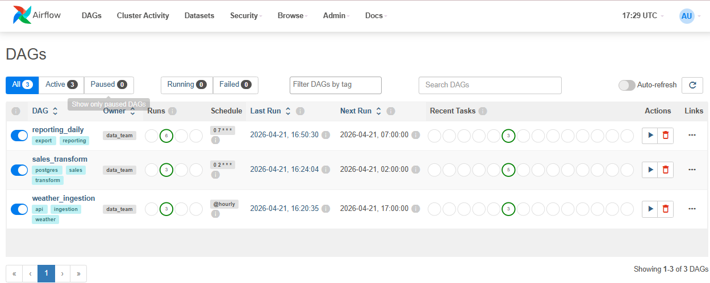
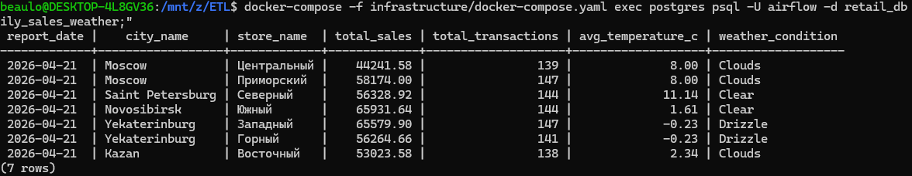
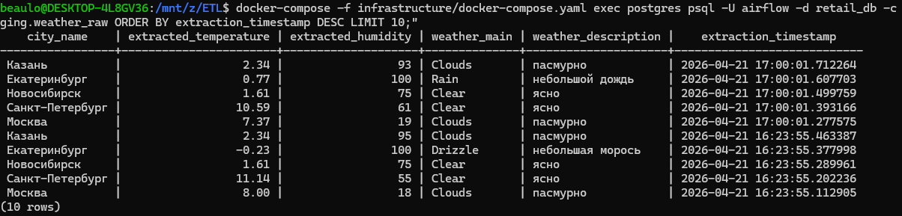
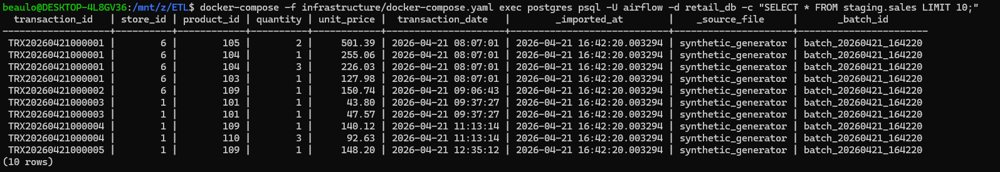
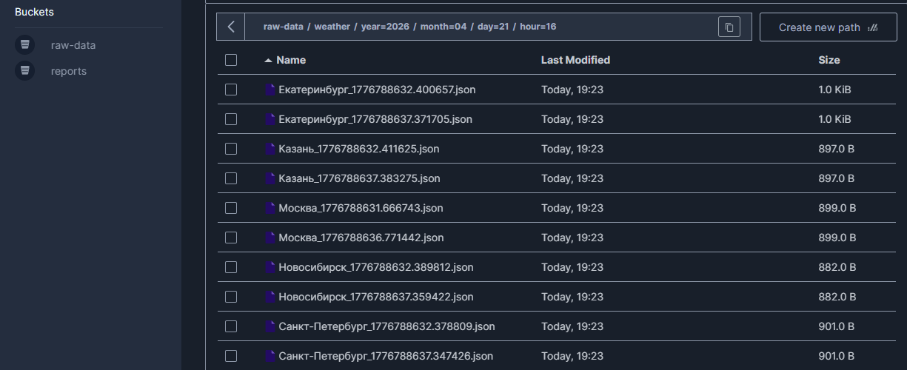
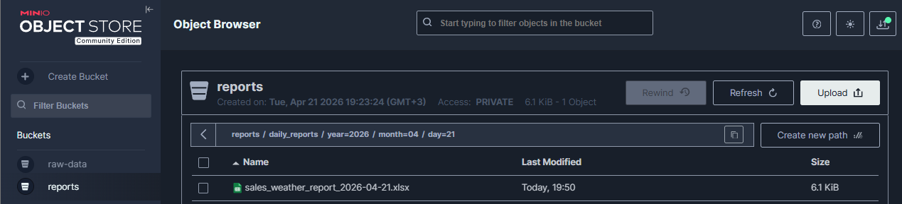
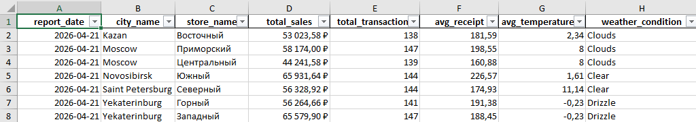
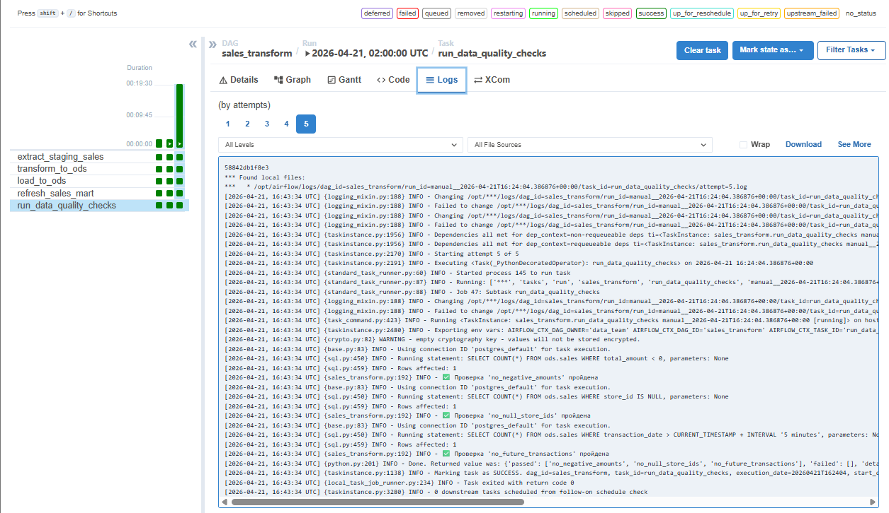
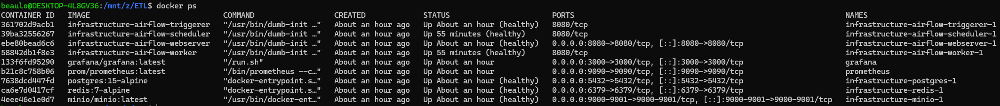

# ETL Pipeline: Sales & Weather Analytics

**Статус проекта:** Production Ready
**Оркестрация:** Apache Airflow 2.8.1
**Хранилище сырых данных:** MinIO (S3-совместимое)
**База данных:** PostgreSQL 15
**Конечная точка доставки:** Excel Reports в MinIO + PostgreSQL Data Mart

---

## О проекте

Этот ETL-пайплайн построен для демонстрации полного цикла работы с данными — от взаимодействия с внешним API до формирования финального отчета в Excel. Система решает конкретную бизнес-задачу: сопоставить данные о розничных продажах с погодными условиями для последующей аналитики (например, как температура и осадки влияют на выручку магазинов).

Все этапы изолированы, версионируются и управляются Apache Airflow. Проект полностью контейнеризован и может быть развёрнут на любой машине с Docker одной командой. Разработка велась в WSL2 (Ubuntu) на Windows, что обеспечивает нативное Linux-окружение для Airflow и PostgreSQL без виртуалок.

---

## Стек технологий и зачем оно здесь

Apache Airflow 2.8.1 — оркестрация всех ETL-процессов. DAGи запускаются по расписанию, управляют зависимостями между задачами, логируют каждый шаг и позволяют перезапускать упавшие таски без дублирования данных.

PostgreSQL 15 — основное хранилище структурированных данных. Разделено на три схемы: staging (сырые данные как есть), ods (очищенные и нормализованные), mart (готовая витрина для отчётов). Такой подход позволяет отслеживать lineage данных и откатываться на любой этап.

MinIO — объектное хранилище, полностью совместимое с AWS S3 API. Используется как Data Lake для хранения сырых JSON-файлов погоды и готовых Excel-отчётов. В продакшене заменяется на S3 без изменения кода.

Python 3.11 + Pandas + SQLAlchemy — язык и библиотеки для всех трансформаций. Pandas используется для очистки данных в DAGах, SQLAlchemy — для работы с PostgreSQL через Airflow Hooks.

Docker + Docker Compose — контейнеризация всех сервисов. Airflow (webserver, scheduler, worker), PostgreSQL, Redis (брокер для Celery), MinIO — всё поднимается одним docker-compose up. Это гарантирует идентичность окружения на любой машине.

WSL2 (Ubuntu) — среда разработки на Windows. Позволяет работать с Linux-контейнерами нативно, без тормозов VirtualBox и проблем с путями. Все команды запускаются из терминала Ubuntu, файлы проекта лежат в /mnt/z/ETL.

OpenWeatherMap API — источник реальных данных о погоде. Бесплатный тариф даёт 1000 запросов в день, что с запасом покрывает ежечасный сбор для 5 городов.

---

## Интерфейсы и мониторинг

 
 
 


---

## Структура проекта

```
/mnt/z/ETL/
├── .github/workflows/           # CI/CD: автотесты при push и PR
│   └── ci.yml
├── dags/                        # Airflow DAGи
│   ├── weather_ingestion.py     # сбор погоды с API
│   ├── sales_transform.py       # трансформация продаж
│   └── reporting_daily.py       # генерация Excel-отчёта
├── plugins/                     # кастомные расширения Airflow
│   ├── hooks/
│   │   └── weather_api_hook.py  # коннектор к OpenWeatherMap
│   └── operators/
│       └── data_quality_check.py # оператор проверки качества данных
├── sql/                         # все SQL-запросы
│   ├── ddl/
│   │   └── create_tables.sql    # создание схем и таблиц
│   ├── transformations/
│   │   ├── mart_sales_weather.sql
│   │   └── aggregate_weather_daily.sql
│   └── analytics/
│       ├── sales_weather_correlation.sql
│       └── store_performance_ranking.sql
├── scripts/                     # генераторы и утилиты
│   └── data_generator/
│       └── generate_synthetic_sales.py  # создание фейковых чеков
├── tests/                       # PyTest
│   ├── conftest.py
│   ├── dags/
│   │   └── test_dag_integrity.py
│   └── transformations/
│       └── test_data_quality.py
├── infrastructure/              # Docker-окружение
│   ├── docker-compose.yaml      # все сервисы
│   ├── Dockerfile.airflow       # кастомный образ Airflow
│   └── config/
│       ├── airflow.cfg
│       └── init-multiple-dbs.sh
├── monitoring/                  # Prometheus + Grafana
│   ├── prometheus/
│   └── grafana/
├── docs/                        # документация и скриншоты
├── .env.example                 # шаблон переменных
├── requirements.txt             # Python-зависимости
├── Makefile                     # шорткаты для управления
└── README.md                    # этот файл
```

---

## Архитектура потоков данных (Что я сделал и откуда что берется)

Ниже описан путь данных от источника до конечного файла. Я спроектировал три независимых DAG'а, чтобы разделить ответственность и упростить отладку. Каждый DAG можно запустить отдельно, и он отработает корректно при наличии данных на предыдущем слое.

### 1. DAG weather_ingestion — сбор погоды

Источник: OpenWeatherMap API. DAG запускается каждый час (schedule="@hourly"). Задачи внутри DAGа:

extract_weather_data — Python-функция, которая через кастомный WeatherApiHook идёт в API и забирает текущую погоду для списка городов: Москва, Санкт-Петербург, Новосибирск, Екатеринбург, Казань. Ответ приходит в JSON, содержит температуру, влажность, давление, скорость ветра, описание погоды. К ответу добавляется метадата: timestamp извлечения, логическая дата DAGа, запрошенный город.

save_raw_to_s3 — полученные JSON сохраняются в MinIO в бакет raw-data. Партиционирование: weather/year=YYYY/month=MM/day=DD/hour=HH/город_timestamp.json. Это стандартный паттерн Data Lake — данные никогда не перезаписываются, всегда можно восстановить историю.

 

load_weather_to_postgres — параллельно JSON пишется в PostgreSQL в таблицу staging.weather_raw. В таблице есть generated columns: extracted_temperature, extracted_humidity, weather_main — они автоматически извлекаются из JSON полей, не нужно писать дополнительный код. Это ускоряет аналитические запросы.

### 2. Генератор синтетических продаж — отдельный скрипт, не DAG

Источник: Python-скрипт generate_synthetic_sales.py. Поскольку доступа к реальной кассе магазина нет, система эмулирует поведение покупателей. Генерируются чеки для 7 магазинов в 5 городах, 10 товаров с категориями. Логика генерации учитывает день недели: в выходные больше позиций в чеке, другое распределение по часам. Чтобы не создавать транзакции из будущего, есть проверка на текущий час — для сегодняшней даты max_hour ограничивается текущим часом.

Данные пишутся напрямую в staging.sales через SQLAlchemy. Каждая транзакция имеет уникальный transaction_id, привязана к store_id и product_id, содержит quantity и unit_price. Добавляются аудит-колонки: _imported_at, _source_file, _batch_id.


### 3. DAG sales_transform — трансформация и загрузка в ODS и Mart

Это главный ETL-пайплайн. Запускается ежедневно в 2:00 UTC (schedule="0 2 * * *"). Состоит из пяти задач, выполняющихся последовательно:

extract_staging_sales — через PostgresHook.get_pandas_df извлекаются все транзакции за логическую дату DAGа из staging.sales. Результат — pandas DataFrame.

transform_to_ods — очистка данных. Отрицательные quantity и unit_price обрезаются в 0 через clip(lower=0). Добавляется колонка total_amount = quantity * unit_price. Добавляются аудит-колонки: etl_created_at, etl_source, etl_batch_id. Если DataFrame пустой, задача завершается с предупреждением, но не падает.

load_to_ods — очищенный DataFrame пишется в ods.sales через df.to_sql(). Здесь была основная боль с правами доступа: Airflow подключается к БД под пользователем etl_user, а таблицы создавались от airflow. Пришлось выдать GRANT ALL на все схемы и таблицы для etl_user, а также USAGE на последовательности для автоинкрементов.

refresh_sales_mart — выполняется SQL-запрос, который агрегирует данные из ods.sales, джойнит со справочником ods.stores, считает метрики: total_sales (сумма), total_transactions (уникальные transaction_id), avg_receipt (средний чек), unique_products_sold (уникальные товары). Результат вставляется в mart.daily_sales_weather с ON CONFLICT DO UPDATE, чтобы можно было перезапускать DAG без дубликатов.

run_data_quality_checks — финальная проверка качества данных. Три SQL-запроса: нет отрицательных сумм (total_amount < 0), нет NULL в store_id, нет транзакций из далёкого будущего (transaction_date > CURRENT_TIMESTAMP + interval '1 hour'). При провале любой проверки DAG падает с ошибкой, и письмо уходит на data-eng@company.com. Это гарантирует, что битые данные не попадут в отчёт.

 

### 4. DAG reporting_daily — генерация Excel-отчёта

Запускается ежедневно в 7:00 UTC, после того как sales_transform отработал. Задачи:

generate_sales_report — через PostgresHook.get_pandas_df читается витрина mart.daily_sales_weather за логическую дату. Если данных нет, возвращается пустой DataFrame.

export_to_excel_s3 — DataFrame через pd.ExcelWriter сохраняется в Excel-файл в памяти (BytesIO). Настраивается форматирование: денежный формат для колонок с суммами, автофильтр. Файл загружается в MinIO в бакет reports с партиционированием daily_reports/year=YYYY/month=MM/day=DD/sales_weather_report_YYYY-MM-DD.xlsx.



send_notification — пишет в лог сообщение о готовности отчёта. В реальной жизни здесь был бы EmailOperator или SlackWebhookOperator.

### 5. Дополнительный шаг: добавление погоды в витрину

Изначально в витрине были только продажи, погода была NULL. Пришлось вручную написать UPDATE, который джойнит ods.weather_daily с mart.daily_sales_weather. Проблема: в витрине города на английском (Moscow), а в погоде — на русском (Москва). Сделал мэппинг через CASE в WHERE. После этого погода подтянулась, и Excel-отчёты стали полными.

---

## Схема базы данных PostgreSQL


Схема   | Таблица             | Содержание
--------|---------------------|-------------------------------------------------
staging | sales               | Сырые чеки из генератора (транзакции)
staging | weather_raw         | JSON погоды + generated columns (температура и т.д.)
ods     | sales               | Очищенные транзакции с total_amount и аудитом
ods     | weather_daily       | Агрегированная погода по дням и городам
ods     | stores              | Справочник 7 магазинов в 5 городах
ods     | products            | Справочник 10 товаров с категориями
mart    | daily_sales_weather | Витрина: продажи + погода по дням и магазинам
audit   | etl_execution_log   | Логи выполнения ETL (опционально)


---

## Проверки качества данных (Data Quality)

В DAG sales_transform встроен кастомный оператор DataQualityCheckOperator, который выполняет SQL-запросы и сравнивает результат с ожидаемым. Проверки:

no_negative_amounts — SELECT COUNT(*) FROM ods.sales WHERE total_amount < 0. Ожидаемый результат: 0. Если есть отрицательные суммы, значит в генераторе или очистке баг.

no_null_store_ids — SELECT COUNT(*) FROM ods.sales WHERE store_id IS NULL. Ожидаемый результат: 0. NULL в store_id ломает JOIN со справочником, витрина будет неполной.

no_future_transactions — SELECT COUNT(*) FROM ods.sales WHERE transaction_date > CURRENT_TIMESTAMP + INTERVAL '1 hour'. Ожидаемый результат: 0. Допускается небольшая дельта в час из-за разницы часовых поясов, но не больше.

При провале любой проверки задача падает, и DAG помечается как failed. Это предотвращает попадание битых данных в отчёт.


---

## Быстрый старт

```bash
# 1. Клонировать репозиторий
git clone https://github.com/yourusername/retail-weather-etl.git
cd retail-weather-etl

# 2. Создать .env файл и добавить API ключ
cp infrastructure/.env.example .env
# Открыть .env и вставить OPENWEATHER_API_KEY=ваш_ключ

# 3. Поднять инфраструктуру
make up
# или docker-compose -f infrastructure/docker-compose.yaml up -d

# 4. Инициализировать Airflow (создать юзера, подключения)
make init

# 5. Открыть Airflow UI
# http://localhost:8080 (admin/admin)

# 6. Включить DAGи и запустить
# В веб-интерфейсе включить тумблеры и нажать Play
```

MinIO Console: http://localhost:9001 (minioadmin/minioadmin)
Grafana: http://localhost:3000 (admin/admin)


---

## Результат

На выходе получается Excel-файл, содержащий ежедневный отчёт по всем магазинам. В отчёте колонки: дата, город, магазин, выручка, количество чеков, средний чек, средняя температура, погодные условия. Файлы хранятся в MinIO и доступны для скачивания.

Весь ETL-процесс полностью автоматизирован. Данные проходят путь от API и генератора через сырые слои, очистку, агрегацию и проверки качества до готового отчёта без ручного вмешательства.
